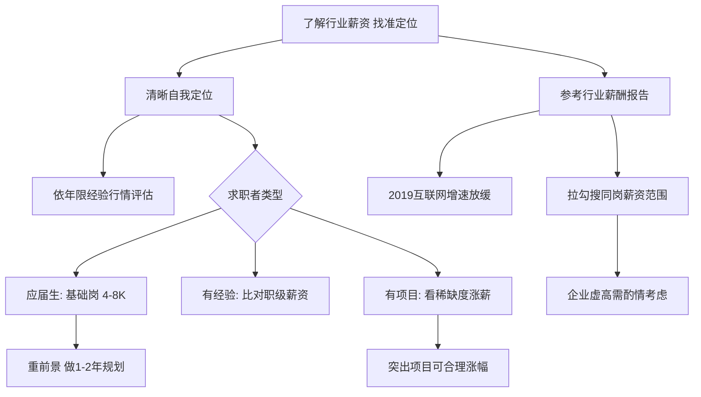

# 了解行业薪资，清晰找准定位

## 清晰找准自己的定位

相信面试到这里已经在谈薪资了，此时是否会有这样的疑惑：所期望的薪资是否能给到呢？这里建议一定要对自己有清晰的定位，比如可根据工作年限、工作经验以及对市场行情等全方位的了解后，才能拿到合理的薪资，也会让企业认为物有所值。

那如何才能争取比较合适的薪资呢？很多小伙伴会根据身边的朋友来判断自己的薪资是否合理。但是很多人没有考虑到，大家的学历不同、做过的项目不同、所应聘的公司也不同，那么薪资水平也很可能会有较大的差距，所以一定要明确自己的情况是怎么样的。

### （1）如果你是应届生

如果你是一个刚刚毕业的小伙伴，如果从事的是基础的岗位一般薪资基本在 4 ~ 8K，但如果选择做程序员，假如学校背景还不错的话，薪资可在 10 ~ 15 K。

不过，不用太在意薪资这一块，毕竟找一个有前景的工作会更重要，建议对自己有一个短期（1~2 年）的职业规划，相信在不久的将来，薪资也会翻倍的。

### （2）如果你有工作经验

如果你已经是一个在专业领域工作多年的候选人，行业经验也非常丰富，相信丰富的经验可以为你创造比较高的收入，你可以比对行业的知名公司职级的薪资结构去判断自己的薪资情况。

### （3）如果你有项目经验

当然也可能有小伙伴会问，如果我前一家公司的薪资高于市场行情，换一家公司是否需要继续要求增加薪资，还是考虑降薪？

这个问题可以根据项目经验来考虑。如果项目经验是行业非常急需而且比较难得的，同时做得又比较突出，要求一个合理涨幅，很多公司也是愿意的。但是如果工作表现一般，只是一个负责副线项目的人，很难争取到新的提成，所以不如脚踏实地地去做一个比较稳定的项目，为自己多积累一些相关的经验，也为后面的涨薪做铺垫。

## 一些行业的薪酬报告

下图是某热门岗位的行业薪酬报告：

图中的一些信息只是一些简单的分析，可以看出 2019 年整个互联网行业的薪资增长并不是很高，相比 2018 年下降了很多。这说明很多公司并没有那么多涨薪的预算，所以在选择公司的时候如果要求过高，很难获得心仪公司的 Offer。

其他岗位的薪资报告，建议到拉勾招聘网站上搜索多家企业发布的同一职位的薪资范围，通过对比来判断该职位的薪资涨幅，但一般企业为了吸引人才，会将薪资范围提高，所以要酌情考虑。

比如下面是高科技与互联网行业的职位薪资情况：

上面的薪资情况，只是工程师的薪酬范围报告，仅供参考。

OK，这节课就讲到这里，下一部分分享"目标明确，阐明沟通"。

---

